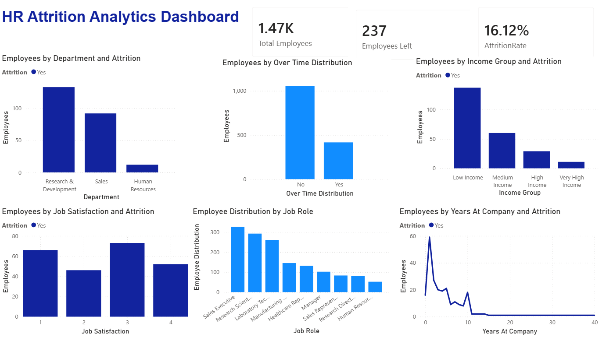
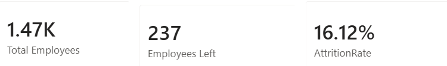
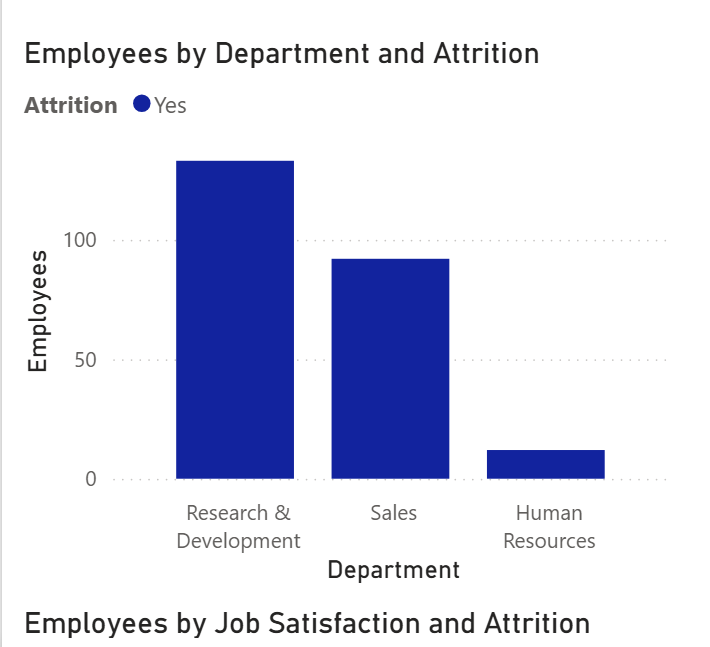
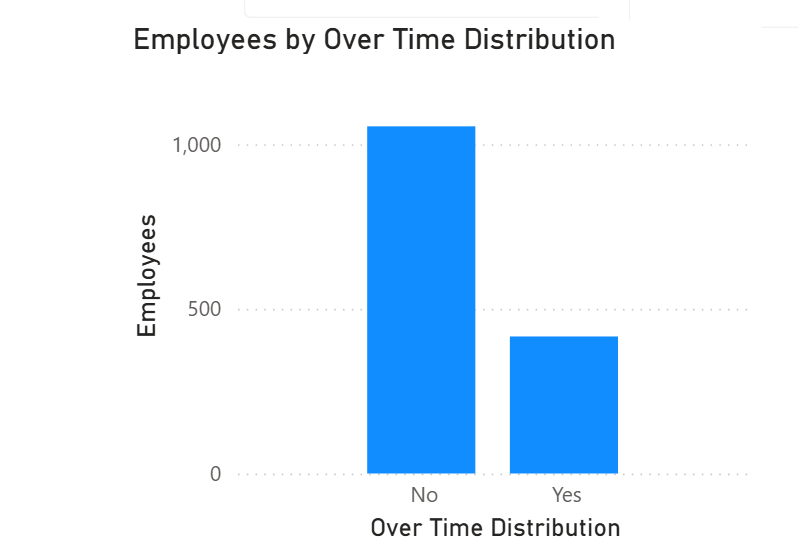
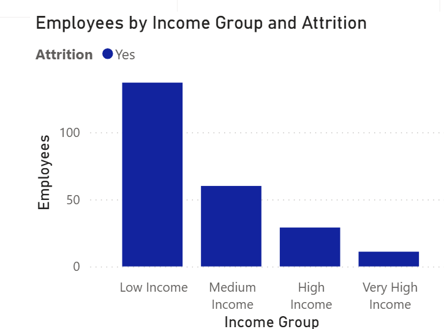
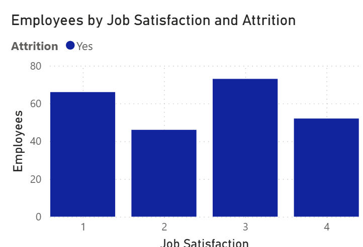
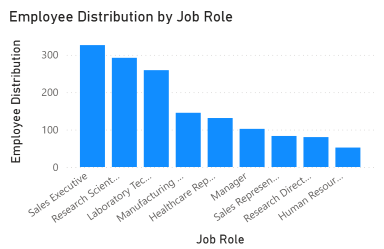
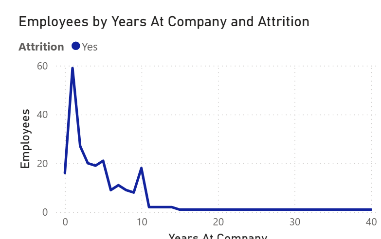

# Using PowerBI

## Project Goal
The goal of this project was to analyze employee attrition using Power BI and identify factors that may contribute to employee turnover. The dashboard helps HR understand workforce trends and make better retention decisions.

## Dataset Used
I used an HR employee attrition dataset containing information such as 
- Employee age
- Department
- Job role and etc.

## Step 1- Data Import
So first step, I used Kaggle to download an HR analytics attrition for practice. Downloading this [file] (https://www.kaggle.com/datasets/pavansubhasht/ibm-hr-analytics-attrition-dataset?resource=download&select=WA_Fn-UseC_-HR-Employee-Attrition.csv) called WA_Fn-UseC_-HR-Employee-Attrition.csv. After downloading it I used get data and added into the CSV upload document section.

After loading it I checked if the ABC icon text type columns and 123 icon number columns were correctly put. After that I created a report which made it into a clean main report workspace. 

## Step 2 - KPI cards
I created three main KPI cards at the top of the dashboard.

### Total employees
Total employees which shows the number of employees presented in the dataset, the purpose of this was to understand workforce size.

### Employees Left
Employees left shows the number of employeed using the attrition filter, to show how many employees left the company.

### Attrition Rate
I created a DAX measure to calculate the percentage of employees who left which I will put in here: 
AttritionRate =
DIVIDE(
    CALCULATE(
        COUNT('WA_Fn-UseC_-HR-Employee-Attrition'[EmployeeNumber]),
        'WA_Fn-UseC_-HR-Employee-Attrition'[Attrition] = "Yes"
    ),
    COUNT('WA_Fn-UseC_-HR-Employee-Attrition'[EmployeeNumber])
)

Which resulted in an Attrition Rate of 16.12% (I set it to be a percentage instead of a decimal)

The purpose of this was to measure overall employee turnover rate. Meaning that approximately 1 out of every 6 employees left the organization.

## Step 3 - Attrition by Department

I created a bar chart showing employees who left by department
X-axis: department
Y-axis: count of EmployeeNumber
Filter: Attrition = Yes

Purpose of this was to identify which departments have the highest employee turnover rate. 

Concluding that Research & Development and Sales showed the highest number of employees leaving. Human resources had the lowest attrition count. This could be due to the fact that technical and sales-related departments may experience higher workpload pressure or employee burnout. 

## Step 4 - Employee Overtime Distribution

I created a chart showing employees overtime status.

Fields used:
X-axis: overtime
Y-axis: Count of EmployeeNumber

This helped compare employees who work overtime with those who do not. 
Which helps HR explore whether workload and overtime may be related to overall employee retention. Attrition for employees working overtime was noticeably high. Overtime may contribute to work-life imbalance, stress and reduced employee retention.

## Step 5 - Attrition By Income Group

DAX used:
IncomeGroup =
SWITCH(
    TRUE(),
    'WA_Fn-UseC_-HR-Employee-Attrition'[MonthlyIncome] < 4000, "Low Income",
    'WA_Fn-UseC_-HR-Employee-Attrition'[MonthlyIncome] < 8000, "Medium Income",
    'WA_Fn-UseC_-HR-Employee-Attrition'[MonthlyIncome] < 12000, "High Income",
    "Very High Income"
)

Fields used:
X-axis: IncomeGroup
Y-axis: Count of EmployeeNumber
Filter: Attrition = Yes

Purpose of this was to analyze whether lower-income employees are more likely to leave.
Attrition was higher among low-income employees, suggesting compensation may affect retention. Attrition decreased as income increased. Concluding that compensation level appears strongly related to ecmployee retention. Lower-paid employees may seek better opportunities elsewhere. Of course there may be other factors contributing like years spent in the company.

## Step 6 - Attrition By Job Satisfaction

I created a chart using job satisfaction levels.

Fields used:
X-axis: JobSatisfaction
Y-axis: Count of EmployeeNumber
Filter: Attrition = Yes

This was to examin whether employee satisfaction is connected to turnover. This will help understand whether lower satisfaction levels are associated with employees leaving. Employees with lower job satisfaction showed notable attrition. Satisfaction levels influenced employee retention patterns. Employee engagement and satisfaction programs may help reduce turnover. 

## Step 7 - Employee Distribution By Job Role

Job role chart fields used:
X-axis: JobRole
Y-axis: Count of EmployeeNumber

This was to understand which job roles have the largest number of employees. Which would help identify large job categories and potential areas where attrition may have a bigger business impact

Sales executive and Research Scientist roles had the largest workforce, while some job roles had much smaller populations. Larger job categories may require more retention monitoring because turnover impact might be higher.

## Step 8 - Attrition Trend By Years at Company

I created a line chart using years at company.

Fields used:
X-Axis: YearsAtCompany
Y-Axis: Count of EmployeeNumber
Filter: Attrition = Yes

The purpose of this was to understand when employees are most likely to leave. Attrition appears higher during early years of employement, suggesting onboarding, career development, or early engagement may be important retention areas. 

# Protfolio Project Summary
This project tested my skills in:
- Data visulaization
- HR analytics
- Power BI dashboard development
- Dax Calculations
- Business intelligence reporting
- Data storytelling
- Interactive filtering and analysis

Doing this I also learnt how to transform raw HR data into actionable business insights for decision-making and employee retention strategies. I had alot of fun doing this project, testing my newly acquired coding skills and applying it to HR.